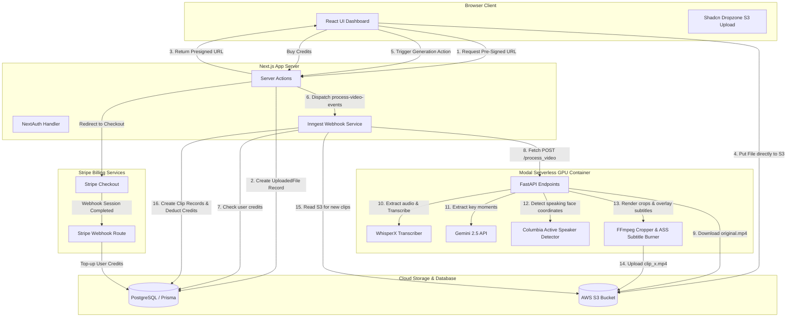
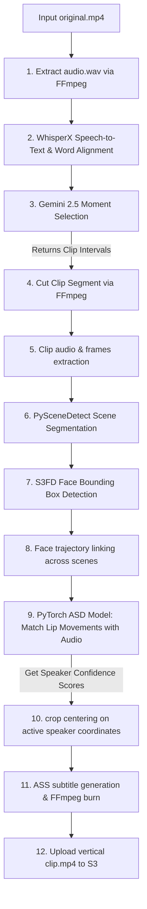
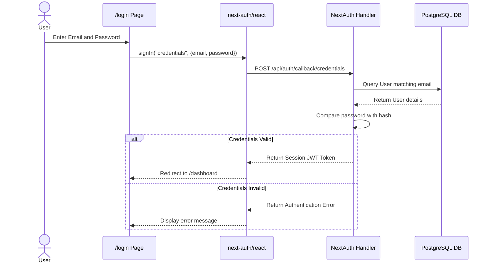
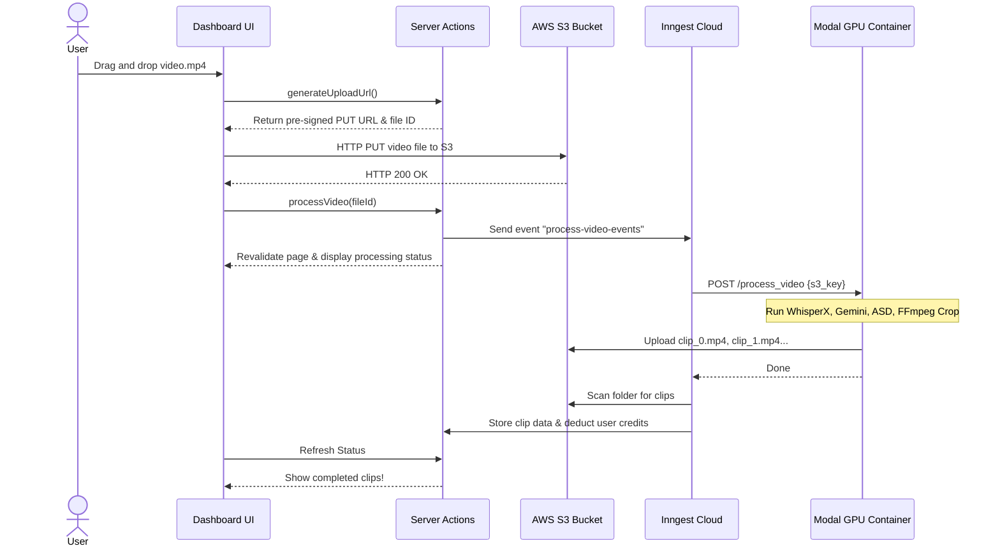

# PodSnap Codebase Explained: Developer Presentation & Q&A Guide

Welcome to the comprehensive technical documentation for **PodSnap** (AI Podcast Clipper). This guide is designed to help any developer-regardless of their familiarity with this project-understand the system inside and out. By reading this document, you will be able to confidently explain the project's design, answer tough technical questions, and present the system during a hackathon or code review.

---

## Table of Contents
1. [High-Level Overview](#1-high-level-overview)
2. [System Architecture](#2-system-architecture)
3. [Folder-by-Folder Breakdown](#3-folder-by-folder-breakdown)
4. [File-by-File Breakdown](#4-file-by-file-breakdown)
5. [API Endpoint Documentation](#5-api-endpoint-documentation)
6. [Database Schema & ER Diagram](#6-database-schema--er-diagram)
7. [Environment Variables](#7-environment-variables)
8. [Authentication & Session Management](#8-authentication--session-management)
9. [Payment Flow & Credits System](#9-payment-flow--credits-system)
10. [AI & Computer Vision Pipeline](#10-ai--computer-vision-pipeline)
11. [User Actions Trace](#11-user-actions-trace)
12. [System Sequence Diagrams](#12-system-sequence-diagrams)
13. [Potential Hackathon Q&A](#13-potential-hackathon-qa)
14. [Hidden Important Details & Security Sensitivities](#14-hidden-important-details--security-sensitivities)
15. [Executive Presentations & Pitch Summaries](#15-executive-presentations--pitch-summaries)

---

## 1. High-Level Overview

### The Problem
Long-form video podcasts (1-2 hours) represent some of the most educational and engaging content on the internet, but modern social media platforms (TikTok, Instagram Reels, YouTube Shorts) are dominated by vertical, high-energy, short-form clips (30-60 seconds) with dynamic subtitles. 
Editing long-form horizontal videos into short vertical clips with highlighted speakers is **highly manual and time-consuming**:
*   Editors must find high-impact moments manually.
*   They must manually frame and crop the active speaker (pan-and-scan) or stitch split screens.
*   They must transcribe the speech and design stylized captions.

### The Solution: PodSnap
PodSnap is an automated AI-driven pipeline that ingests long-form horizontal podcast video files (.mp4), detects high-engagement segments, locates who is talking in real-time, crops the video to a vertical 9:16 aspect ratio centered on the active speaker, and burns high-visibility stylized subtitles directly onto the output.

### Core Features
1.  **Direct-to-S3 Large File Uploads**: Client-side uploads bypass serverless execution limits by fetching pre-signed S3 upload URLs.
2.  **GPU-Accelerated Transcription**: WhisperX model transcribes audio and produces precise word-level alignments.
3.  **LLM-Powered Moment Identification**: Google Gemini 2.5 Flash analyzes word-level transcripts and flags the most viral 30-to-60 second clips.
4.  **Audio-Visual Active Speaker Detection (ASD)**: A custom PyTorch neural network analyzes video frames (mouth movements) and audio frequencies (MFCCs) to mathematically identify the active speaker.
5.  **Smart Vertical Cropping**: Dynamic crop tracking centers on the speaker's face bounding box, falling back to a blurred-padding letterbox configuration if no speaker is active.
6.  **Styled Burning Subtitles**: Subtitles are aligned to timestamps, formatted with SSA/ASS styles (custom fonts, margins, outline, and shadow), and rendered directly into the video stream via FFmpeg.
7.  **Credits & Monetization System**: Users get 10 free credits upon signup. They can purchase credit packs (50, 150, 500) via a Stripe checkout portal.

### Tech Stack Rationale
*   **Next.js 15 (App Router)**: Fast, server-side data loading, optimized React 19 Client/Server Components, and secure Server Actions.
*   **Tailwind CSS v4 & Shadcn UI**: Modern styling architecture utilizing zero-config v4 PostCSS compilation, providing beautiful gradients, responsive grids, and standard components.
*   **Prisma ORM & PostgreSQL**: A robust relational data structure to keep track of user credentials, credits, uploaded files, and generated clip paths.
*   **Inngest**: Event-driven background queue manager. It prevents timeout issues on Next.js serverless functions by handling heavy jobs asynchronously.
*   **FastAPI & Modal Labs**: Serverless GPU execution platform. Modal allows us to host Python deep learning modules (WhisperX, PyTorch face detectors, active speaker models, OpenCV) on-demand, charging only when processing a video.

---

## 2. System Architecture

PodSnap uses a split-architecture design: a **Web App Node** (handling billing, files list, clips metadata, and authentication) and an **AI Worker Node** (executing deep learning on Nvidia GPU serverless containers).



---

## 3. Folder-by-Folder Breakdown

### `ai-podcast-clipper-frontend/`
Contains the entire Next.js web application including backend database migrations and business logic.
*   **`prisma/`**: Defines the PostgreSQL database schema and contains migration histories.
*   **`public/`**: Static assets (fonts, icons).
*   **`src/actions/`**: Secure server-side functions (Server Actions) accessible directly by frontend clients, managing user creation, Stripe sessions, pre-signed upload URLs, and S3 play links.
*   **`src/app/`**: Next.js App Router containing page directories (`login`, `signup`, `dashboard`, `dashboard/billing`) and API endpoints (`api/auth`, `api/inngest`, `api/webhooks/stripe`).
*   **`src/components/`**: Modular reusable UI structures including forms, navigation, dynamic loading cards, and S3 dropzone managers.
*   **`src/inngest/`**: Defines the Inngest background event loop, webhook configs, and step-based worker tasks.
*   **`src/lib/`**: Generic helpers (e.g. `bcryptjs` password hashing wrapper, classnames tailwind-merge configuration).
*   **`src/schemas/`**: Input validator definitions using Zod (e.g., verifying correct email syntax and password length limits).
*   **`src/server/`**: Core infrastructure initialization (NextAuth configuration options, PrismaClient singleton database pool).
*   **`src/styles/`**: Global CSS styling incorporating the Tailwind CSS v4 compiler settings.

### `ai-podcast-clipper-backend/`
Python container deployed serverless-ly on Modal Labs.
*   **`asd/`**: A package implementing the "Columbia Active Speaker Detection" model.
    *   **`weight/`**: Location for the pretrained AVA speaker weights model (`finetuning_TalkSet.model`).
    *   **`model/`**: PyTorch neural network model definitions (incorporating the S3FD face detector).
    *   **`ASD.py`**: Audio-visual correlation models.
    *   **`Columbia_test.py`**: The main execution script which detects scenes, isolates faces, tracks trajectories, and outputs speaker confidence metrics.
    *   **`dataLoader.py`**: Speeds up face-mouth image array loads into PyTorch tensors.
*   **`main.py`**: Modal App declaration. Declares the GPU image dependencies, downloads face detector weights, and hosts the FastAPI web endpoint.
*   **`requirements.txt`**: Standard Python environment requirements (FastAPI, PyTorch, whisperx, OpenCV, Boto3, etc.).
*   **`ytdownload.py`**: Standalone helper script using `pytubefix` and `ffmpeg` to download high-resolution test videos.

---

## 4. File-by-File Breakdown

### Backend Files
  
#### 1. [`ai-podcast-clipper-backend/main.py`](file:///c:/Users/ankit/Desktop/PodSnap/ai-podcast-clipper-backend/main.py)
*   **Purpose**: Main entry point for the AI worker node hosted on Modal.
*   **What It Does**: Sets up the serverless GPU Docker container (CUDA 12.4, ffmpeg, PyTorch, fonts), defines models loading, hosts the API endpoints, downloads videos from S3, transcribes them, identifies moments with Gemini, calls active speaker classification, crops the video frames, and uploads output clips back to S3.
*   **Exports**: `AiPodcastClipper` (Modal Class), `process_clip`, `create_vertical_video`, `create_subtitles_with_ffmpeg`.
*   **Imports**: `modal`, `whisperx`, `google.genai`, `boto3`, `cv2`, `ffmpegcv`, `pysubs2`, `fastapi`.
*   **Execution Flow**: Triggered via `POST /process_video` on the Modal web url by the Inngest runner function.
*   **Business Logic**:
    *   Lines 51–150: `create_vertical_video` parses active speaker scores. If speaker is found (score >= 0), crops centered on their face bounding box. If no speaker (score < 0), resizes video with blurred padding.
    *   Lines 152–237: `create_subtitles_with_ffmpeg` parses aligned words, clusters them in groups of 5, saves them to an `.ass` (SSA) subtitle file (using *Anton* font, size 140, centered), and runs FFmpeg with `ass` video filter.
    *   Lines 425–475: `process_video` coordinates download, transcription, Gemini moment extraction, and processes up to 5 clips.
*   **Interview Explanation**: *"This is the brain of the video editor. It runs on a serverless GPU on Modal, takes an S3 video path, transcribes it, uses Gemini to select the best clips, runs active speaker tracking, crops it vertically, and overlays subtitles."*

#### 2. [`ai-podcast-clipper-backend/asd/Columbia_test.py`](file:///c:/Users/ankit/Desktop/PodSnap/ai-podcast-clipper-backend/asd/Columbia_test.py)
*   **Purpose**: Runs the Active Speaker Detection (ASD) pipeline on a video clip.
*   **What It Does**: Cuts the clip, extracts audio/video frames, runs PySceneDetect content detection, runs S3FD face detection, tracks faces across frames, crops face clips, extracts audio MFCCs, feeds audio/video frames into the ASD PyTorch network, and outputs face track locations and active speaker scores.
*   **Exports**: `scene_detect`, `inference_video`, `track_shot`, `crop_video`, `evaluate_network`, `main`.
*   **Imports**: `scenedetect`, `torch`, `cv2`, `python_speech_features`, `scipy`.
*   **Execution Flow**: Called by `main.py` via `subprocess.run(["python", "Columbia_test.py", ...])`.
*   **Business Logic**: Matches visual lip movements (frames) to audio frequencies (MFCCs). If visual movements align with vocal frequencies, the model assigns a high positive classification score.
*   **Interview Explanation**: *"This script implements an audio-visual active speaker detection model. It tracks faces and matches mouth movements with spoken audio frequencies to verify who is actually talking at any given second."*

#### 3. [`ai-podcast-clipper-backend/asd/ASD.py`](file:///c:/Users/ankit/Desktop/PodSnap/ai-podcast-clipper-backend/asd/ASD.py)
*   **Purpose**: Wrapper class for loading the active speaker detection neural network.
*   **What It Does**: Defines network loaders, weights mappings, and forwards input features into the loss models to obtain scores.

#### 4. [`ai-podcast-clipper-backend/asd/dataLoader.py`](file:///c:/Users/ankit/Desktop/PodSnap/ai-podcast-clipper-backend/asd/dataLoader.py)
*   **Purpose**: Custom PyTorch dataset loader.
*   **What It Does**: Speeds up audio/video numpy array load operations into tensors for model training/evaluation.

#### 5. [`ai-podcast-clipper-backend/asd/loss.py`](file:///c:/Users/ankit/Desktop/PodSnap/ai-podcast-clipper-backend/asd/loss.py)
*   **Purpose**: Loss calculations for audio-visual alignment models.
*   **What It Does**: Implements loss modules that compute Cosine Similarity between visual embeddings and audio embeddings.

#### 6. [`ai-podcast-clipper-backend/asd/train.py`](file:///c:/Users/ankit/Desktop/PodSnap/ai-podcast-clipper-backend/asd/train.py)
*   **Purpose**: Code used to train the ASD classifier model.
*   **What It Does**: Executes batches of backpropagation over a labeled dataset (AVA-ActiveSpeaker).

#### 7. [`ai-podcast-clipper-backend/ytdownload.py`](file:///c:/Users/ankit/Desktop/PodSnap/ai-podcast-clipper-backend/ytdownload.py)
*   **Purpose**: Test utility.
*   **What It Does**: Downloads 1080p MP4 audio/video streams from YouTube and merges them via FFmpeg.

---

### Frontend Files

#### 8. [`ai-podcast-clipper-frontend/prisma/schema.prisma`](file:///c:/Users/ankit/Desktop/PodSnap/ai-podcast-clipper-frontend/prisma/schema.prisma)
*   **Purpose**: Database schema.
*   **What It Does**: Configures PostgreSQL models for user credits, NextAuth credentials, uploaded videos, and generated short-form clips.
*   **Interview Explanation**: *"This is our Prisma database schema. It defines relationships between Users, their uploaded videos, and the resulting AI clips, while storing credits and Stripe customer IDs."*

#### 9. [`ai-podcast-clipper-frontend/src/env.js`](file:///c:/Users/ankit/Desktop/PodSnap/ai-podcast-clipper-frontend/src/env.js)
*   **Purpose**: Validates all environment variables.
*   **What It Does**: Declares schemas for variables like S3 credentials, Stripe keys, database urls, and server options.
*   **Exports**: `env`.
*   **Imports**: `@t3-oss/env-nextjs`, `zod`.
*   **Execution Flow**: Evaluated at build and start time.

#### 10. [`ai-podcast-clipper-frontend/src/actions/auth.ts`](file:///c:/Users/ankit/Desktop/PodSnap/ai-podcast-clipper-frontend/src/actions/auth.ts)
*   **Purpose**: Server Action for user signup.
*   **What It Does**: Validates input, hashes the password, creates a Stripe customer, and registers the user in PostgreSQL.
*   **Exports**: `signUp`.
*   **Imports**: `bcryptjs`, `stripe`, `db`.
*   **Business Logic**: Creates a Stripe customer for every registered user to link credit cards during future billing.
*   **Interview Explanation**: *"This registers users, hashes passwords securely, and sets up a unique customer account in Stripe for frictionless checkout."*

#### 11. [`ai-podcast-clipper-frontend/src/actions/generation.ts`](file:///c:/Users/ankit/Desktop/PodSnap/ai-podcast-clipper-frontend/src/actions/generation.ts)
*   **Purpose**: Coordinates video clipping trigger and video playback.
*   **What It Does**: Sends processing triggers to Inngest and generates 1-hour pre-signed GET URLs for S3 clips.
*   **Exports**: `processVideo`, `getClipPlayUrl`.
*   **Imports**: `inngest`, `s3`, `db`.
*   **Interview Explanation**: *"Bridges our database and background worker. It launches the video processing pipeline and generates secure, expiring links so clients can play and download S3 files."*

#### 12. [`ai-podcast-clipper-frontend/src/actions/s3.ts`](file:///c:/Users/ankit/Desktop/PodSnap/ai-podcast-clipper-frontend/src/actions/s3.ts)
*   **Purpose**: Generates pre-signed S3 upload URLs.
*   **What It Does**: Provides pre-signed S3 PUT URLs so the browser can upload files directly to S3 up to 500MB without hitting Next.js server payload limits.
*   **Exports**: `generateUploadUrl`.
*   **Imports**: `@aws-sdk/client-s3`, `uuid`.
*   **Interview Explanation**: *"It gives the user a temporary token to upload large videos directly to S3, bypassing server size limits."*

#### 13. [`ai-podcast-clipper-frontend/src/actions/stripe.ts`](file:///c:/Users/ankit/Desktop/PodSnap/ai-podcast-clipper-frontend/src/actions/stripe.ts)
*   **Purpose**: Creates Stripe checkout sessions.
*   **What It Does**: Generates checkout URLs based on Small, Medium, or Large credit packages.
*   **Exports**: `createCheckoutSession`.
*   **Imports**: `stripe`, `db`, `next/navigation`.

#### 14. [`ai-podcast-clipper-frontend/src/inngest/client.ts`](file:///c:/Users/ankit/Desktop/PodSnap/ai-podcast-clipper-frontend/src/inngest/client.ts)
*   **Purpose**: Initializes Inngest.
*   **Exports**: `inngest`.

#### 15. [`ai-podcast-clipper-frontend/src/inngest/functions.ts`](file:///c:/Users/ankit/Desktop/PodSnap/ai-podcast-clipper-frontend/src/inngest/functions.ts)
*   **Purpose**: Orchestrates the multi-step background video processing workflow.
*   **What It Does**: Checks credits -> sets status to processing -> calls Modal GPU backend -> lists generated S3 objects -> creates Clip database records -> deducts user credits based on clips found -> marks status as processed.
*   **Exports**: `processVideo`.
*   **Imports**: `S3Client`, `db`, `env`.
*   **Execution Flow**: Triggered asynchronously by Inngest Cloud after the client dispatches a `process-video-events` event.
*   **Business Logic**:
    *   Ensures that only **1 concurrent video is processed per user** (`concurrency` configuration) to prevent database race conditions or GPU over-allocation.
    *   Deducts credits equivalent to the number of clips actually created: `decrement: Math.min(credits, clipsFound)`.
*   **Interview Explanation**: *"This acts as the conductor. It ensures the user has credits, triggers the AI worker on Modal, scans for output clips, records them in the database, and charges the user’s credit balance."*

#### 16. [`ai-podcast-clipper-frontend/src/app/api/auth/[...nextauth]/route.ts`](file:///c:/Users/ankit/Desktop/PodSnap/ai-podcast-clipper-frontend/src/app/api/auth/[...nextauth]/route.ts)
*   **Purpose**: Exposes NextAuth endpoints.
*   **What It Does**: Maps authentication requests to JWT and session handlers.
*   **Exports**: `GET`, `POST`.

#### 17. [`ai-podcast-clipper-frontend/src/app/api/inngest/route.ts`](file:///c:/Users/ankit/Desktop/PodSnap/ai-podcast-clipper-frontend/src/app/api/inngest/route.ts)
*   **Purpose**: Exposes the Inngest server endpoint.
*   **What It Does**: Enables Inngest Cloud to trigger background steps on our local servers.
*   **Exports**: `GET`, `POST`, `PUT`.

#### 18. [`ai-podcast-clipper-frontend/src/app/api/webhooks/stripe/route.ts`](file:///c:/Users/ankit/Desktop/PodSnap/ai-podcast-clipper-frontend/src/app/api/webhooks/stripe/route.ts)
*   **Purpose**: Listens to Stripe payment triggers.
*   **What It Does**: Confirms valid webhook signature, reads price ID, increments user credits (+50, +150, or +500), and sends a 200 response.
*   **Exports**: `POST`.
*   **Interview Explanation**: *"This hears payments from Stripe. When a user buys a credit pack, Stripe sends a secure ping, and we increment the user's credits instantly."*

#### 19. [`ai-podcast-clipper-frontend/src/components/dashboard-client.tsx`](file:///c:/Users/ankit/Desktop/PodSnap/ai-podcast-clipper-frontend/src/components/dashboard-client.tsx)
*   **Purpose**: Client-side UI dashboard.
*   **What It Does**: Provides file upload dropzone, displays processing status indicators (queued, processing, processed, failed), and displays the user's generated clips.
*   **Exports**: `DashboardClient`.
*   **Interview Explanation**: *"This is the user interface. It manages uploading files directly to S3 via pre-signed links, lets users monitor background clipping progress, and lists completed clips."*

#### 20. [`ai-podcast-clipper-frontend/src/components/clip-display.tsx`](file:///c:/Users/ankit/Desktop/PodSnap/ai-podcast-clipper-frontend/src/components/clip-display.tsx)
*   **Purpose**: Displays vertical video files.
*   **What It Does**: Fetches secure playback URLs for each clip in a React hook, rendering standard video players and download buttons.
*   **Exports**: `ClipDisplay`.

#### 21. [`ai-podcast-clipper-frontend/src/components/nav-header.tsx`](file:///c:/Users/ankit/Desktop/PodSnap/ai-podcast-clipper-frontend/src/components/nav-header.tsx)
*   **Purpose**: Global header.
*   **What It Does**: Displays branding, logged-in user profile fallback letter, credit count, and sign-out buttons.

---

## 5. API Endpoint Documentation

### 1. Next.js Web App API Endpoints

#### Authentication Endpoint
*   **Path**: `/api/auth/[...nextauth]`
*   **Methods**: `GET`, `POST`
*   **Auth Requirements**: None (Public)
*   **Description**: Handles credentials provider routing, signing, and session retrieval.

#### Inngest serving webhook
*   **Path**: `/api/inngest`
*   **Methods**: `GET`, `POST`, `PUT`
*   **Auth Requirements**: Signature verification from Inngest Cloud.
*   **Description**: Exposes worker triggers to Inngest Cloud.

#### Stripe Webhook Receiver
*   **Path**: `/api/webhooks/stripe`
*   **Method**: `POST`
*   **Request Body**: Raw Stripe event stream (JSON string).
*   **Header**: `stripe-signature` (mandatory for validation).
*   **Response**: `200 OK` (or `400/500` on validation/internal errors).
*   **Internal Flow**: Extracts Stripe transaction payload -> finds corresponding customer -> updates database credits count.

---

### 2. Modal GPU Backend API Endpoints

#### Process Video Endpoint
*   **Path**: `/process_video` (mapped to Modal app instance)
*   **Method**: `POST`
*   **Request Body**:
    ```json
    {
      "s3_key": "unique-uuid-directory/original.mp4"
    }
    ```
*   **Auth Requirements**: Header `Authorization: Bearer <AUTH_TOKEN>`.
*   **Internal Flow**:
    1.  Downloads raw video from S3.
    2.  Extracts audio and calls WhisperX model on GPU for transcription.
    3.  Passes transcription segments to Gemini 2.5 Flash API to get highlight timestamps.
    4.  Runs active speaker tracking.
    5.  Crops output segments to vertical 9:16 aspect ratio.
    6.  Generates and burns ASS styled subtitles onto each vertical output clip.
    7.  Uploads vertical files back to S3.

---

## 6. Database Schema & ER Diagram

We use a PostgreSQL database mapped via Prisma.

### Table Definitions

*   **`User`**: Core account info.
    *   `id` (String, Primary Key): CUID representation.
    *   `email` (String, Unique): User email address.
    *   `password` (String): Hashed password.
    *   `credits` (Int, Default 10): Processing credits.
    *   `stripeCustomerId` (String, Optional): Links account to Stripe.
*   **`UploadedFile`**: Tracks raw input video status.
    *   `id` (String, Primary Key)
    *   `s3Key` (String): Pointer to the file in AWS S3.
    *   `displayName` (String): Original filename.
    *   `uploaded` (Boolean): Marks if S3 file upload is complete.
    *   `status` (String, Default "queued"): Values are: `queued`, `processing`, `processed`, `no credits`, `failed`.
*   **`Clip`**: Tracks vertical output videos.
    *   `id` (String, Primary Key)
    *   `s3Key` (String): Location of cropped video in S3.
    *   `uploadedFileId` (String, Foreign Key): Linked source file.
    *   `userId` (String, Foreign Key): Linked owner.
*   **`Account` & `Session` & `VerificationToken`**: NextAuth schema adapters tracking sessions.

### Database ER Diagram

```mermaid
erDiagram
    USER ||--o{ ACCOUNT : "has"
    USER ||--o{ SESSION : "owns"
    USER ||--o{ UPLOADEDFILE : "uploads"
    USER ||--o{ CLIP : "claims"
    UPLOADEDFILE ||--o{ CLIP : "generates"

    USER {
        string id PK
        string email UNIQUE
        string password
        int credits
        string stripeCustomerId UNIQUE
    }

    ACCOUNT {
        string id PK
        string userId FK
        string provider
        string providerAccountId
    }

    SESSION {
        string id PK
        string sessionToken UNIQUE
        string userId FK
        datetime expires
    }

    UPLOADEDFILE {
        string id PK
        string s3Key INDEX
        string displayName
        boolean uploaded
        string status
        string userId FK
    }

    CLIP {
        string id PK
        string s3Key INDEX
        string uploadedFileId FK
        string userId FK
    }
```

---

## 7. Environment Variables

Below are the variables declared and validated in [`src/env.js`](file:///c:/Users/ankit/Desktop/PodSnap/ai-podcast-clipper-frontend/src/env.js):

| Variable Name | Used In | Purpose / Description | What Breaks If Missing? |
| :--- | :--- | :--- | :--- |
| `DATABASE_URL` | Prisma Client | Connection URI for the Postgres DB. | App crashes immediately; cannot fetch users/clips. |
| `AUTH_SECRET` | NextAuth | Hashing key for signing session JWT tokens. | Session tokens cannot be verified (users logged out). |
| `AWS_ACCESS_KEY_ID` | S3 actions / Inngest | Credentials to read/write from Amazon S3. | Pre-signed upload links and clip downloads fail. |
| `AWS_SECRET_ACCESS_KEY`| S3 actions / Inngest | Secret credentials for S3 bucket connection. | Cannot authenticate S3 file requests. |
| `AWS_REGION` | S3 actions / Inngest | Location of the S3 bucket (e.g. `us-east-1`). | S3 connections timeout or throw region errors. |
| `S3_BUCKET_NAME` | S3 actions / Inngest | AWS bucket where files are written/read. | S3 operations throw bucket-not-found errors. |
| `PROCESS_VIDEO_ENDPOINT` | Inngest background job | Modal endpoint URL (FastAPI) for AI processing. | Background queue cannot invoke AI pipeline. |
| `PROCESS_VIDEO_ENDPOINT_AUTH` | Inngest background job | Bearer token to authorize requests to Modal API. | Modal returns `401 Unauthorized`; process fails. |
| `STRIPE_SECRET_KEY` | Server Actions / Webhook | Key for Stripe billing session creation. | Buying credits fails during checkout step. |
| `STRIPE_WEBHOOK_SECRET` | Stripe Webhook route | Validates payment webhook signature. | Webhook returns `400`; bought credits won't update. |
| `NEXT_PUBLIC_STRIPE_PUBLISHABLE_KEY` | Client UI pages | Public key used in billing interface. | Unable to display Stripe payment forms. |
| `BASE_URL` | Stripe checkout | Return redirect URL (e.g. `http://localhost:3000`).| Redirect back to app after payment fails. |

---

## 8. Authentication & Session Management

PodSnap handles user auth using **NextAuth.js v5 (auth.js)**:

1.  **Signup Flow**:
    *   User fills credentials on `/signup`. Zod validates inputs.
    *   `signUp` Server Action queries Postgres. If email is unique, it hashes the password with `bcryptjs` (salt rounds: 12), generates a Stripe Customer ID, and creates a `User` database record.
2.  **Login Flow**:
    *   Credentials provider calls `authorize` handler inside NextAuth config.
    *   Queries `User` table, compares passwords, and returns user object if correct.
3.  **Session Strategy**:
    *   Uses **JWT (JSON Web Token)** session storage strategy.
    *   Callbacks inject user database ID (`token.sub`) directly into the JWT token, which propagates into client session queries.
4.  **Security**:
    *   NextAuth configuration uses JWT encryption.
    *   Protected pages (like `/dashboard` and `/dashboard/billing`) verify session presence on the server. If missing, they redirect the browser to `/login` immediately.

---

## 9. Payment Flow & Credits System

We implement a one-time purchase credit credit tier:

*   **Packs Pricing**:
    *   **Small**: ₹99 for 50 credits.
    *   **Medium**: ₹249 for 150 credits.
    *   **Large**: ₹699 for 500 credits.
*   **Checkout Execution**:
    1.  User clicks purchase button. `createCheckoutSession` Server Action verifies session, queries database for user's `stripeCustomerId`, and initializes Stripe checkout in `mode: "payment"`.
    2.  Stripe redirects client to Stripe billing dashboard.
    3.  On payment confirmation, Stripe triggers `/api/webhooks/stripe`.
    4.  Webhook verifies signatures using `STRIPE_WEBHOOK_SECRET`, retrieves line items to check which price ID was purchased, and increments the user's credits balance accordingly in PostgreSQL.
*   **Credits Usage**:
    *   1 credit represents **1 short-form clip generated** (not minutes processed).
    *   During background runs, Inngest checks if `credits > 0`. If yes, it launches video processing.
    *   After video generation, Inngest scans the output directory, calculates how many clips were generated (`clipsFound`), and decrements the balance by `Math.min(credits, clipsFound)`.

---

## 10. AI & Computer Vision Pipeline

The AI pipeline runs on Modal Labs inside an Nvidia L40S GPU container.



### Step-by-Step AI Pipeline Logic:

1.  **Transcription & Alignment**:
    *   WhisperX extracts mono audio `audio.wav` at 16kHz.
    *   Runs speech-to-text (`large-v2` model) and merges token alignments to get exact millisecond timestamps for each spoken word.
2.  **LLM Selection**:
    *   The aligned word JSON is sent to `gemini-2.5-flash` with a strict system prompt: find logical, high-impact QA exchanges or narrative segments between 30 and 60 seconds.
    *   Gemini returns a clean JSON array of clip ranges, e.g., `[{"start": 120.5, "end": 165.2}]`.
3.  **Active Speaker Tracking**:
    *   For each clip range, FFmpeg cuts out the video segment.
    *   `Columbia_test.py` performs scene-change detection to divide the video into individual shots (preventing tracking paths jumping across camera cuts).
    *   Runs S3FD face detector to find face bounding boxes.
    *   Tracks faces frame-by-frame using IOU tracking.
    *   Feeds face tracks and audio features (MFCCs) into the ASD model. The model computes visual embedding vectors of lip movements and audio vectors of speech, outputting confidence scores showing who is talking.
4.  **Dynamic 9:16 Cropping**:
    *   If speaker confidence is positive, the system crops a 1080x1920 window centered on the active speaker's face coordinates.
    *   If no speaker is identified (score < 0), it resizes the original horizontal frame to fit the vertical width, padding the top and bottom with blurred video backgrounds.
5.  **ASS Styled Subtitle Rendering**:
    *   Aligned words inside the clip timeframe are packaged into an Advanced Substation Alpha (`.ass`) subtitle script.
    *   Uses high-contrast *Anton* font (size 140, outline border 2.0, shadow 2.0) aligned at the bottom center.
    *   FFmpeg renders the subtitles directly into the video stream to produce the final `.mp4` clip.

---

## 11. User Actions Trace

### Trace 1: User Uploads Podcast & Gets Clips

```
[UI Dashboard] 
   └── Dropzone: Selects "interview.mp4"
   └── Clicks "Upload and Generate Clips"
        │
[Server Action: src/actions/s3.ts -> generateUploadUrl()]
   ├── Verifies session
   ├── Generates UUID (e.g. "a5f8-b39d")
   ├── Registers UploadedFile (s3Key: "a5f8-b39d/original.mp4", status: "queued", uploaded: false)
   └── Returns AWS S3 presigned PUT URL
        │
[UI Dashboard]
   └── Client performs PUT request directly to S3 URL with file content
   └── On HTTP 200, calls processVideo Server Action
        │
[Server Action: src/actions/generation.ts -> processVideo()]
   ├── Sends event "process-video-events" to Inngest
   └── Updates UploadedFile database record to (uploaded: true)
        │
[Inngest Background Job: src/inngest/functions.ts -> processVideo()]
   ├── Step 1: Queries database to check user credits
   ├── Step 2: Updates status on UploadedFile to "processing"
   ├── Step 3: Makes HTTP POST to Modal endpoint /process_video
   │    │
   │    └─── [Modal Serverless GPU Container: main.py -> process_video()]
   │            ├── Downloads video from S3
   │            ├── WhisperX transcribes video -> Gemini finds clips
   │            ├── For each clip: Runs Columbia ASD tracker -> Crops 9:16 vertical
   │            ├── Burns stylized ASS subtitles into video
   │            └── Uploads clip_0.mp4, clip_1.mp4 to S3 under "a5f8-b39d/" directory
   │
   ├── Step 4: Scans S3 folder "a5f8-b39d/" to find generated clips
   ├── Step 5: Creates database Clip records linked to original UploadedFile
   ├── Step 6: Deducts user credits based on clips found
   └── Step 7: Updates UploadedFile status to "processed"
```

### Trace 2: User Purchases Small Credit Pack

```
[UI Billing Page]
   └── Clicks "Buy 50 credits" on small package card
        │
[Server Action: src/actions/stripe.ts -> createCheckoutSession()]
   ├── Verifies user session
   ├── Fetches user stripeCustomerId
   ├── Creates Stripe Checkout session containing Price ID for small pack
   └── Performs redirection to Stripe Checkout URL
        │
[Stripe Portal]
   └── User completes credit card payment
        │
[Stripe API Webhook: src/app/api/webhooks/stripe/route.ts]
   ├── Validates webhook signature
   ├── Receives event "checkout.session.completed"
   ├── Retrieves session line items to extract Price ID (Small Pack)
   └── Increments credits (+50) on User record matching stripeCustomerId
```

---

## 12. System Sequence Diagrams

### Authentication Flow


### Video Upload & AI Generation Flow


---

## 13. Potential Hackathon Q&A

### Beginner Questions

#### Q1: What is the main purpose of using serverless GPUs on Modal instead of hosting a VM?
*   **Answer**: Hosting a server with active Nvidia GPUs (like L4) costs hundreds of dollars a month even when idle. Modal is serverless, meaning it spins up our container in seconds, runs our AI models, and stops, billing us only for the exact seconds we use.
*   **Related Files**: [`ai-podcast-clipper-backend/main.py`](file:///c:/Users/ankit/Desktop/PodSnap/ai-podcast-clipper-backend/main.py).

#### Q2: How does the app prevent uploading large video files from crashing our server?
*   **Answer**: The user's file is not sent to our Next.js backend server. Instead, our backend generates a temporary pre-signed URL from AWS S3, and the browser uploads the video directly to S3.
*   **Related Files**: [`src/actions/s3.ts`](file:///c:/Users/ankit/Desktop/PodSnap/ai-podcast-clipper-frontend/src/actions/s3.ts), [`src/components/dashboard-client.tsx`](file:///c:/Users/ankit/Desktop/PodSnap/ai-podcast-clipper-frontend/src/components/dashboard-client.tsx).

---

### Intermediate Questions

#### Q3: Why is Inngest used instead of a standard Next.js API route to call Modal?
*   **Answer**: Next.js API routes have maximum execution timeouts (usually 10-60 seconds on serverless platforms). Processing video transcription and face detection takes minutes. Inngest manages these long-running jobs in background threads, handles concurrency, and retries automatically if a step fails.
*   **Related Files**: [`src/inngest/functions.ts`](file:///c:/Users/ankit/Desktop/PodSnap/ai-podcast-clipper-frontend/src/inngest/functions.ts), [`src/app/api/inngest/route.ts`](file:///c:/Users/ankit/Desktop/PodSnap/ai-podcast-clipper-frontend/src/app/api/inngest/route.ts).

#### Q4: Explain the difference between transcription and word-level alignment in WhisperX.
*   **Answer**: Standard Whisper models output timestamps at the segment level (roughly 2-5 seconds). WhisperX runs a phoneme-level alignment model after transcribing, matching speech audio waveforms directly to letters, which gives us precise millisecond timestamps for every individual word.
*   **Related Files**: [`ai-podcast-clipper-backend/main.py`](file:///c:/Users/ankit/Desktop/PodSnap/ai-podcast-clipper-backend/main.py).

---

### Advanced Questions

#### Q5: How does the Active Speaker Detector work under the hood? Why is simple face detection not enough?
*   **Answer**: Face detection only tells us *where* faces are, not *who is talking*. In a multi-host podcast, there are multiple faces on screen. The ASD model extracts visual embeddings of mouth movements and audio feature representations (MFCCs). It calculates the mathematical correlation (using Cosine Similarity) between the mouth movements and the audio waveform to identify the active speaker.
*   **Related Files**: [`ai-podcast-clipper-backend/asd/Columbia_test.py`](file:///c:/Users/ankit/Desktop/PodSnap/ai-podcast-clipper-backend/asd/Columbia_test.py), [`ai-podcast-clipper-backend/asd/ASD.py`](file:///c:/Users/ankit/Desktop/PodSnap/ai-podcast-clipper-backend/asd/ASD.py).

#### Q6: How does the dynamic cropper work when two speakers are talking or when no face is detected?
*   **Answer**: The cropper uses the face tracking trajectories from the ASD model. It checks for the track with the highest positive speaker score. If one is found, it crops around their face center coordinates. If no tracks have positive scores (e.g. silence, or camera looking at a slide), it falls back to a padded letterbox mode: it scales down the original horizontal frame, and pads the remaining space with a heavily blurred version of the original frame.
*   **Related Files**: [`ai-podcast-clipper-backend/main.py`](file:///c:/Users/ankit/Desktop/PodSnap/ai-podcast-clipper-backend/main.py) (functions `create_vertical_video` and `process_clip`).

---

## 14. Hidden Important Details & Security Sensitivities

### Critical Configs & Code Locations
*   **Database Client**: [`src/server/db.ts`](file:///c:/Users/ankit/Desktop/PodSnap/ai-podcast-clipper-frontend/src/server/db.ts) uses a global variable cache in development to prevent hot-reloads from exhausting database connection pools.
*   **Concurrency Constraints**: In [`src/inngest/functions.ts`](file:///c:/Users/ankit/Desktop/PodSnap/ai-podcast-clipper-frontend/src/inngest/functions.ts), we set `concurrency: { limit: 1, key: "event.data.userId" }`. This prevents a single user from running concurrent tasks, which protects database integrity and prevents S3 file conflicts.
*   **Stripe Webhook Verification**: In [`src/app/api/webhooks/stripe/route.ts`](file:///c:/Users/ankit/Desktop/PodSnap/ai-podcast-clipper-frontend/src/app/api/webhooks/stripe/route.ts), we reconstruct the event using `stripe.webhooks.constructEvent` to verify that the request actually came from Stripe, preventing users from forging payment completions.
*   **Modal API Authentication**: In [`ai-podcast-clipper-backend/main.py`](file:///c:/Users/ankit/Desktop/PodSnap/ai-podcast-clipper-backend/main.py), the `process_video` route checks the bearer token against `AUTH_TOKEN`, preventing unauthorized requests to our GPU endpoint.

---

## 15. Executive Presentations & Pitch Summaries

### 2-Minute Presentation Script
> *"Hello judges, long-form content is king, but short-form vertical video is how you get discovered. PodSnap makes vertical clipping instant. Users log in, drop their raw podcast video, and our system does the rest. It uses GPU-accelerated WhisperX to transcribe, Gemini to identify high-impact moments, and a PyTorch Active Speaker Detector to track who is speaking and center the camera on them dynamically. It then burns stylized, high-visibility subtitles directly onto the vertical output. A process that takes editors hours is completed in minutes for pennies. It is fully integrated with Stripe payments and is highly scalable."*

### 5-Minute Technical Deep-Dive
> *"PodSnap uses a modern split-architecture. The frontend is built on Next.js 15, storing user sessions, metadata, and payment states in PostgreSQL via Prisma. To handle uploads up to 500MB, we use S3 pre-signed upload links, bypassing Next.js file limits.
> Once uploaded, an event is sent to Inngest to trigger a background worker. This worker invokes our Python container hosted on Modal serverless GPU infrastructure. 
> Inside Modal, we extract audio, run WhisperX for phoneme-level word alignment, and feed the text to Gemini 2.5 Flash to locate the start and end of high-impact segments. 
> For each segment, we run face detection using S3FD and scene change detection to build tracking paths. Our Active Speaker model correlates mouth movements with audio frequencies using PyTorch, identifying the speaker's face coordinates.
> If a speaker is found, we crop centered on their face; if not, we default to blurred letterboxing. Finally, we generate SSA style captions and burn them via FFmpeg before saving files to S3. Payment integrations are secured using Stripe checkout sessions and signature verification webhooks."*

### Technical Q&A Pitch
*   **Cost Efficiency**: By using Modal serverless GPUs instead of running continuous EC2 instances, we reduce hosting costs by over 90%.
*   **Robustness**: By using Inngest step-based workers, we ensure database changes, file verification, and API requests execute sequentially with built-in retries, preventing orphan files or unpaid video runs.
*   **User Experience**: Features like Direct-to-S3 uploads and realtime processing indicators make video processing feel fast and reliable.

---
*End of Guide. You are now ready to showcase PodSnap!*
